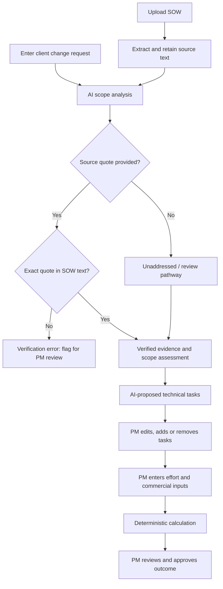
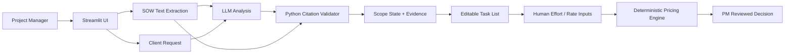

<div align="center">
  
  <br />
  

  # ScopeGuard AI

  **AI-assisted scope intelligence. Deterministic verification. Human-controlled delivery.**

  <p>
    
    
    
    
  </p>

  **[Overview](#-overview) · [How It Works](#-how-it-works) · [V3 Safeguards](#-v3-safeguards) · [Demo](#-live-demo-scenarios) · [Architecture](#-architecture) · [Getting Started](#-getting-started)**
</div>

## ✨ Overview

**ScopeGuard AI** is a decision-support workflow for agencies and project managers who need to evaluate incoming client requests against an existing **Statement of Work (SOW)**. It transforms an ambiguous request into a structured, evidence-aware scope assessment and an editable technical work plan—**without letting an LLM invent authoritative contract evidence or make the final commercial decision**.

A client says, *“Can we add SSO and a new integration?”* ScopeGuard AI helps the project manager answer the questions that matter:

- **Was it agreed?** Evaluate the request against the actual SOW.
- **Where is the evidence?** Show a source quote and independently check it against the uploaded document.
- **What if the contract is silent?** Represent the absence of evidence explicitly.
- **What must be built?** Generate a first-draft task breakdown that the PM can correct.
- **What does it cost?** Keep estimates, rates, and pricing decisions under deterministic, human-controlled logic.

> **Design principle:** AI interprets. Code verifies. Humans authorize.

## 🧠 The Problem

Scope creep rarely announces itself. Small requests arrive through calls and messages; teams must quickly determine whether the work is already contracted, outside the agreement, or needs clarification. Purely generative systems can sound convincing even when their evidence is wrong, their task recommendations ignore the actual stack, or they quietly confuse “not mentioned” with “approved.”

ScopeGuard AI is designed to reduce that ambiguity with **verifiable citations, explicit uncertainty, editable tasks, and controlled estimation**.

## ⚡ How It Works



**Separation of responsibilities**

| Layer | Owns | Must not own |
| :-- | :-- | :-- |
| **LLM** | Intent interpretation, draft scope reasoning, candidate citations, suggested tasks | Final evidence verification, binding pricing decisions |
| **Python validation** | Exact source-quote membership checks and explicit error states | Inventing missing contract language |
| **Streamlit interface** | Transparent results, editable tasks, human review | Quietly treating model output as approved |
| **Project manager** | Technical corrections, estimates, rates, approvals | Delegating accountability to the model |

## 🛡️ V3 Safeguards

### 01 · Deterministic Citation Verification

**The risk:** An LLM can fabricate or subtly alter an SOW clause while presenting it as a direct quotation.

**The V3 patch:** A Python-level membership check verifies each proposed quote against the extracted source text:

```python
# Core validation concept (illustrative)
def verify_sow_quote(extracted_quote: str, raw_sow_text: str) -> bool:
    return bool(extracted_quote) and extracted_quote in raw_sow_text

if not verify_sow_quote(extracted_quote, raw_sow_text):
    st.error("Verification Error: Citation not found in source document")
    # Block the quote from being displayed as verified evidence.
```

**Outcome:** Model confidence cannot bypass code-level verification. A failed match is shown to the PM as a verification error, not a valid citation.

**Important boundary:** Exact matching proves the quoted characters exist in the extracted text; it does **not** by itself prove the quote is relevant, complete, correctly interpreted, or present in a faithfully extracted scan. Normalization, document offsets, and contextual review are possible future hardening measures.

### 02 · A Fourth State for the “Silent SOW”

**The risk:** A request may concern a feature or integration that the contract never mentions.

**The V3 patch:** A dedicated **⚪ UNADDRESSED IN SOW** state prevents the AI from pretending that silence is an explicit clause.

| State | Meaning | Recommended handling |
| :-- | :-- | :-- |
| 🟢 **In Scope** | The SOW provides evidence that the requested work is included | PM validates applicability |
| 🔴 **Out of Scope** | The SOW provides evidence that the work is excluded or beyond defined scope | Prepare change-control discussion |
| 🟡 **Ambiguous / Needs Review** | Conflicting or insufficient evidence makes classification uncertain | Escalate to PM / contract owner |
| ⚪ **Unaddressed in SOW** | No relevant clauses were identified | **Provisional** out-of-scope treatment, subject to the actual agreement and PM review |

**Example**

> **Client request:** “Please add blockchain wallet connectivity.”  
> **SOW:** Describes a conventional company website; no blockchain-related provisions identified.  
> **Result:** ⚪ **UNADDRESSED IN SOW**  
> **System guidance:** “No clauses found regarding blockchain integration. Provisionally treat as out of scope pending contractual review.”

**Important boundary:** A missing clause is not automatically a legally valid exclusion. The default is a **workflow recommendation**, not a contract-law conclusion; the SOW's actual change-control and interpretation terms govern.

### 03 · Editable Technical Task Architecture

**The risk:** Even a correct scope assessment can produce an unsuitable technical plan when the AI does not know the agency's architecture, vendors, or existing services.

**The V3 patch:** Suggested implementation tasks appear as **editable Streamlit inputs** before estimation. The PM can **rewrite, add, reorder, or delete** tasks.

```text
AI suggestion:  Build custom authentication database
PM correction:  Configure Clerk SSO integration

AI suggestion:  Implement notification service
PM correction:  Reuse existing event-driven notification pipeline
```

**Outcome:** The system accelerates planning without pretending to know the team's internal stack. **The PM remains the technical authority.**

### 04 · Enterprise Privacy Shield

**The risk:** SOW documents may contain pricing, customer details, confidential terms, and commercial plans.

**The V3 privacy target:**

- Use an appropriate **commercial API with an explicit zero-data-retention arrangement**, where available and contractually enabled.
- Confirm prompts and uploaded materials **are not used for provider model training** under the chosen terms.
- Process documents **in memory during the active session** and minimize persistence.
- Remove transient session data and uploaded content when the workflow ends.
- Avoid leaking source documents through application logs, analytics, error traces, or third-party tools.

> **Privacy note:** “No model training,” “zero data retention,” and “immediate purge” are different guarantees. Actual deployment must verify the provider's contractual settings, application logging, caches, session lifecycle, backups, and deletion behavior. The architecture describes the intended privacy posture; a live deployment should be audited before an enterprise-grade compliance claim is made.

## 🧩 Architecture



### The trust boundary

An LLM response is treated as **untrusted proposed data**, not as a contract ruling. Validation and human approval form separate gates. This is the core of the **NeuroBridge Standard** as applied in ScopeGuard AI: a probabilistic reasoning layer connected to deterministic checks and an accountable human operator.

## 🎬 Live Demo Scenarios

<details open>
<summary><b>Demo A — Fake citation injection</b></summary>

**Action:** Supply a model-generated quote that does not appear in the uploaded SOW.  
**Expected behavior:** Python rejects the quote; Streamlit displays **“Verification Error: Citation not found in source document.”** The quote is not accepted as verified evidence.  
**What it proves:** The application does not rely solely on the prompt instruction “quote verbatim.”
</details>

<details>
<summary><b>Demo B — Silent SOW / totally new feature</b></summary>

**Action:** Ask for blockchain integration when the SOW includes no relevant language.  
**Expected behavior:** ⚪ **UNADDRESSED IN SOW**; explain missing evidence and route the decision to PM review.  
**What it proves:** Absence of contract evidence is represented explicitly.
</details>

<details>
<summary><b>Demo C — Agency-specific tech stack correction</b></summary>

**Action:** Let the AI propose a custom authentication database, then replace that task with **“Configure Clerk SSO integration.”**  
**Expected behavior:** The edited task list becomes the basis for subsequent human-entered estimates.  
**What it proves:** AI suggestions are editable rather than authoritative.
</details>

<details>
<summary><b>Demo D — Human-in-the-loop estimate</b></summary>

**Action:** Modify a task, enter hours and rates, and show the computed result.  
**Expected behavior:** The calculation responds to the PM's inputs rather than an invented LLM price.  
**What it proves:** Commercial calculations are controlled by deterministic logic.
</details>

## 🔬 Verification Checklist

| Test | Expected result |
| :-- | :-- |
| Valid, verbatim clause | Quote passes exact membership check |
| Fabricated clause | Verification error; not presented as verified |
| Paraphrase presented as direct quote | Verification error |
| Empty quote | Verification error |
| Request absent from the SOW | Unaddressed state; PM review |
| Contradictory SOW sections | Ambiguous state and escalation |
| Wrong AI task suggestion | PM can replace or remove it |
| Edited hours or rate | Recalculation uses current human inputs |
| Confidential SOW data | Protected according to configured provider and app retention policies |

## 🛠️ Technology & Responsibilities

| Component | Technology / pattern | Purpose |
| :-- | :-- | :-- |
| User interface | **Streamlit** | Document upload, findings, editable tasks, review |
| Application logic | **Python** | Parsing, state handling, deterministic validation |
| Reasoning layer | **Commercial LLM API** | Scope interpretation and task suggestions |
| Citation guard | **Exact substring verification** | Reject fabricated verbatim evidence |
| Estimation | **Deterministic arithmetic + PM inputs** | Transparent effort-based calculations |
| Privacy | **Configured provider retention controls + session hygiene** | Minimize exposure of confidential content |

*The precise model provider, document parser, directory layout, and deployment platform depend on the actual implementation; this README intentionally does not invent them.*

## 🚀 Getting Started

This repository's setup commands must match the actual application files and environment. A **typical Streamlit/Python setup** looks like this once the project contains its dependency manifest and application entry point:

```bash
# Clone your actual repository URL
# git clone https://github.com/<OWNER>/<REPOSITORY>.git
# cd <REPOSITORY>

python -m venv .venv

# Windows (PowerShell)
.venv\Scripts\Activate.ps1

# macOS / Linux instead:
# source .venv/bin/activate

pip install -r requirements.txt

# Replace app.py if your Streamlit entry point has a different name
streamlit run app.py
```

**Before running:** configure the chosen model provider's credentials through Streamlit secrets or environment variables. **Never commit API keys, SOW contents, or customer documents.** The instructions above are a setup template, not a claim that particular filenames are already present.

## 🧭 Roadmap

- **V3 demo focus:** quote verification, Silent SOW classification, editable task drafts, human-controlled estimation, and privacy-aware session flow.
- **Next hardening:** PDF extraction quality checks, quote offsets and source highlighting, semantic relevance review, and more robust handling of scanned SOWs.
- **Production readiness:** audit logs without sensitive document contents, role-based access, explicit retention tests, security review, and contract-policy configuration per organization.
- **Extended workflow:** exportable change-request summaries and agency-specific task templates.

## 🏆 Hackathon Context

Built as a **V3 Final Demo Candidate** for the **Starnest Academy AI Hackathon**. ScopeGuard AI addresses the judge-facing question: **How can generative AI assist contractual and technical decisions without becoming the source of truth?**

The answer is a bounded workflow: **evidence must be verified, silence must remain visible, tasks must be editable, and pricing must remain under human control.**

<div align="center">
  <h3>ScopeGuard AI</h3>
  <p><strong>Verify the scope. Empower the human.</strong></p>
  <sub>Built for clearer requirements, safer AI assistance, and accountable project decisions.</sub>
</div>
